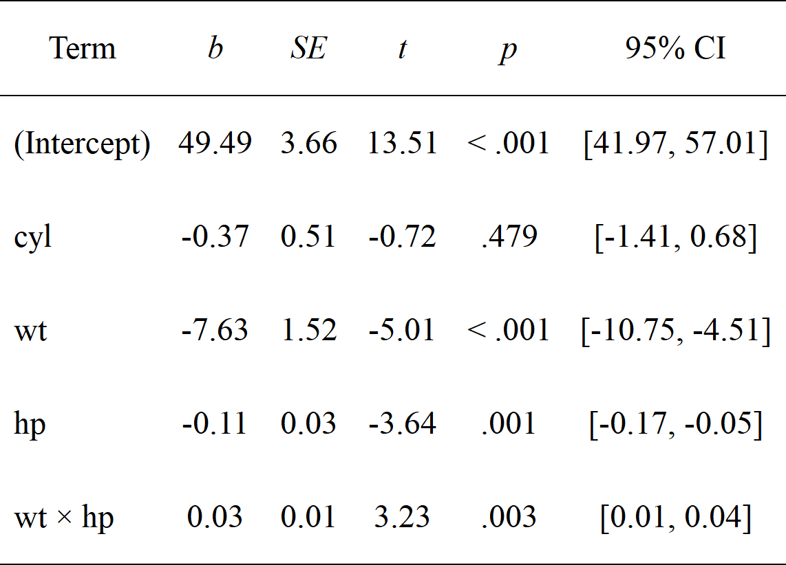
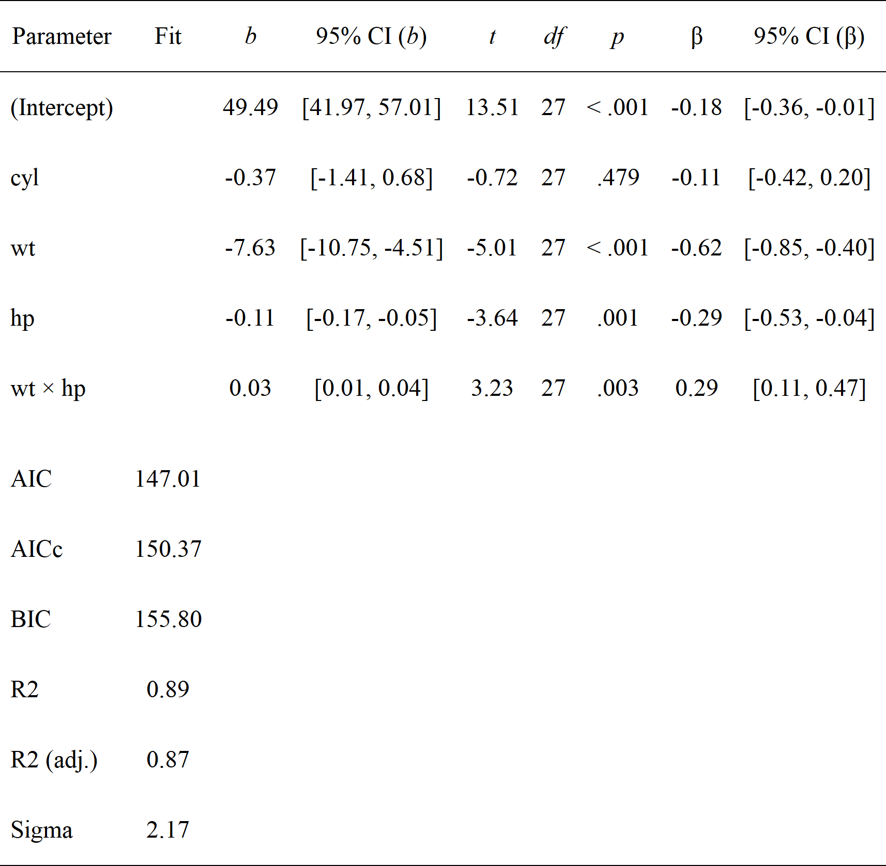
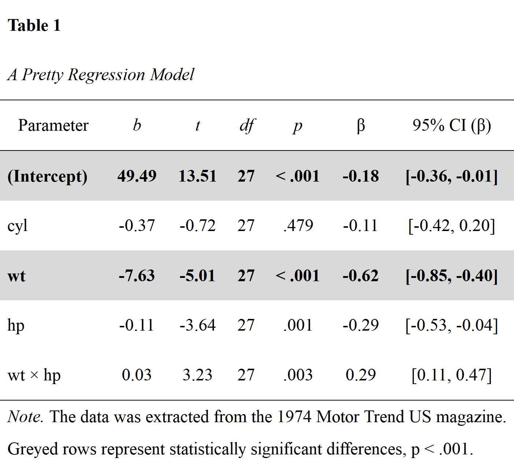
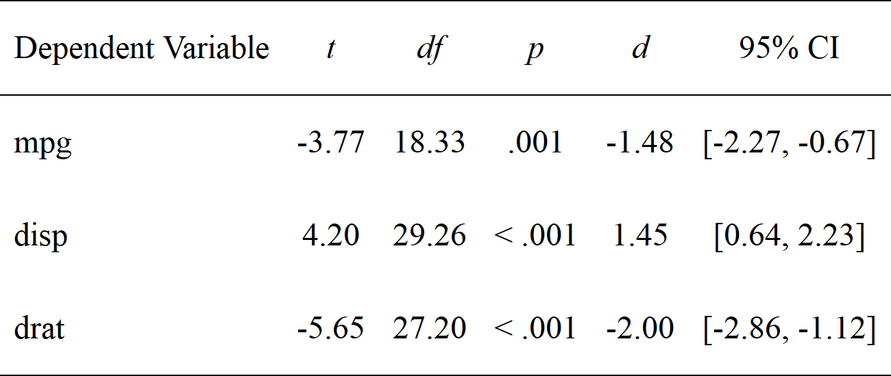
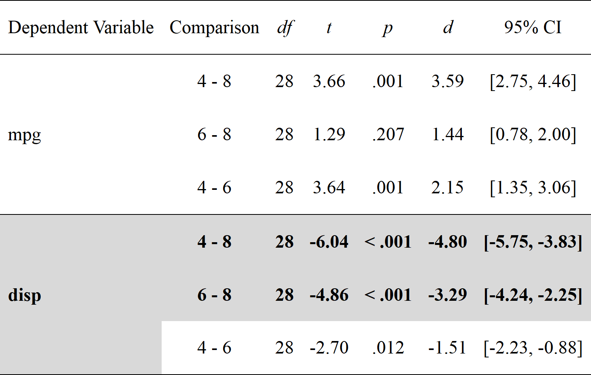
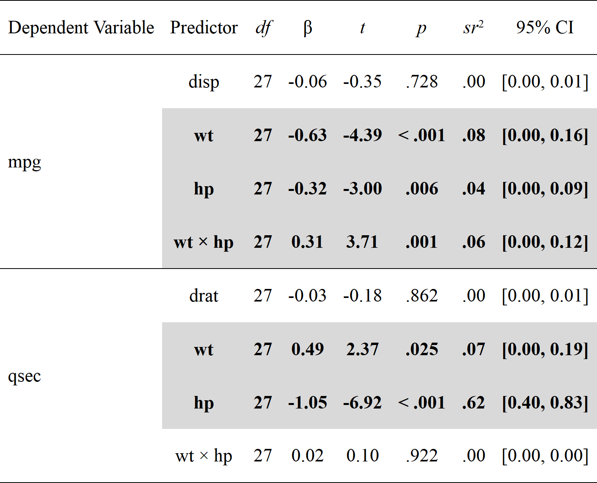
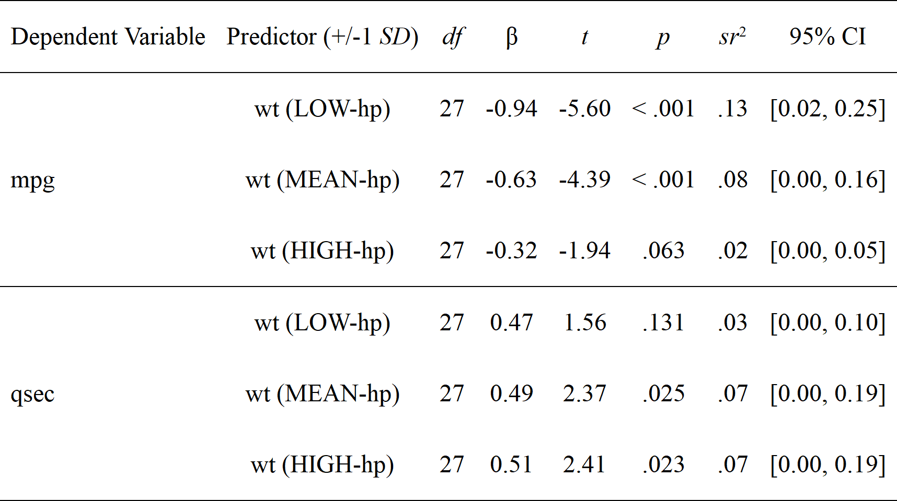
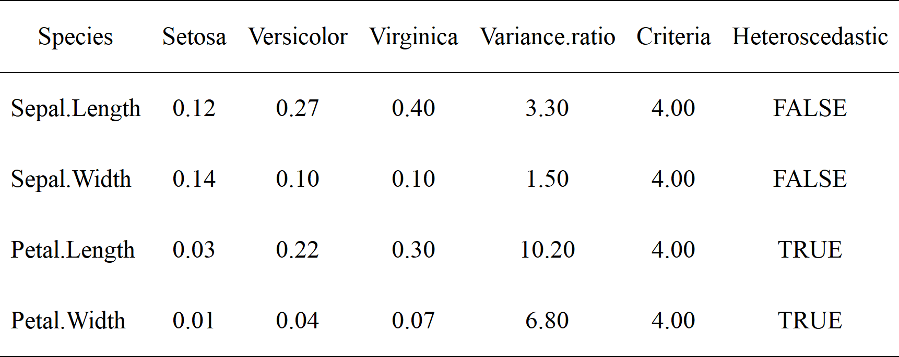
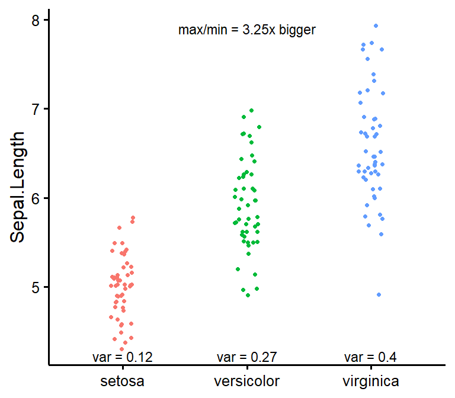

# Summary

{rempsyc} is an R package of convenience functions that make the
analysis-to-publication workflow faster, easier, and less error-prone.
It enables nice APA tables exportable to Word (via {flextable}) and
easily customizable APA-compliant plots (via {ggplot2}). It makes it
easy to run statistical tests, check assumptions, and automate various
tasks common in psychology research.

# Statement of need

There are many reasons to use R ([R Core Team, 2022](#ref-base2021)) for
analyzing and reporting data from research studies, such as being
compatible with the ideals of open science ([Quintana,
2020](#ref-quintana2020)). However, R has a major downside for novices:
its steep learning curve due to its programmatic interface, in contrast
to perhaps more user-friendly point-and-click software. Of course, this
flexibility is also a strength, as the R community can and does come
together to produce packages that make using R increasingly easier and
more user-friendly (e.g., the *easystats* ecosystem [Lüdecke et al.,
2019/2023](#ref-easystatsPackage)). The {rempsyc} package (Really Easy
Methods for Psychology) contributes to this momentum by providing
convenience functions that remove as much friction as possible between
your script and your manuscript (in particular, if you are using
Microsoft Word).

There are mainly three things that go into a manuscript: text, tables,
and figures. {rempsyc} does not generate publication-ready text
summarizing analyses; for this, see the {report} package ([Makowski et
al., 2021/2023](#ref-reportPackage)). Instead, {rempsyc} focuses on the
production of publication-ready tables and figures. Below, I go over a
few quick examples of those.

# Examples Features

## Publication-Ready Tables

Many researchers using R still copy-paste the values from the R console
to their manuscript, or retype them manually. Yet, this approach
increases the risks of copy-paste and retyping errors so common in
psychology. This problem is not trivial given that according to some
estimates, up to 50% of articles in psychology have at least one
statistical error ([Nuijten et al., 2016](#ref-nuijten2016prevalence)).
Ideally, one should be able to format the table directly in R, and to
export it to Word directly.

Formatting your table properly in R is already a time-consuming task,
but fortunately several packages take care of this step (e.g., the
{broom} or {report} packages, [Makowski et al.,
2021/2023](#ref-reportPackage); [Robinson et al., 2022](#ref-broom2022),
and there are several others). Exporting these formatted tables to
Microsoft Word remains a challenge however. Some packages do export to
Word (e.g., [Stanley & Spence, 2018](#ref-stanley2018reproducible)), but
their formatting is often rigid especially when using analyzes or table
formats that are not supported by default.

{rempsyc} solves this problem by allowing maximum flexibility: you
manually create the data frame exactly the way you want, and then only
use the magical function, `nice_table()`, on the resulting data frame.
`nice_table()` works on any data frame, even non-statistical ones like
`mtcars`.

One of its main benefit however is the automatic formatting of
statistical symbols and its integration with other packages. We can for
example create a {broom} table and then apply `nice_table()` on it. It
suits particularly well the pipe workflow.

    library(rempsyc)

    lm(mpg ~ cyl + wt * hp, mtcars) |>
      broom::tidy(conf.int = TRUE) |>
      nice_table(broom = "lm")

{width=60%}

We can do the same with a {report} table.

    stats.table <- lm(mpg ~ cyl + wt * hp, mtcars) |>
      report::report() |>
      as.data.frame()

    nice_table(stats.table)

{width=80%}

The {report} package provides quite comprehensive tables, so one may
request an abbreviated table with the `'short'` argument. For
convenience, it is also possible to highlight significant results for
better visual discrimination, using the `'highlight'` argument.[1] Once
satisfied with the table, we can add a title and note.

    my_table <- nice_table(
      stats.table, short = TRUE, highlight = 0.001,
      title = c("Table 1", "A Pretty Regression Model"),
      note = c("The data was extracted from the 1974 Motor Trend US magazine.",
               "Greyed rows represent statistically significant differences, p < .001."))
    my_table

{width=80%}

One can then easily save the resulting table to Word with
`flextable::save_as_docx()`, specifying the object name and desired
path.

    flextable::save_as_docx(my_table, path = "nice_tablehere.docx")

Additionally, tables created with `nice_table()` are {flextable} objects
([Gohel & Skintzos, 2022](#ref-flextable2022)), and can be modified as
such.[2]

## Formattting Results of Analyses

{rempsyc} also provides its own set of functions to prepare statistical
tables before they can be fed to `nice_table()` and saved to Word.

### *t* tests

    nice_t_test(data = mtcars,
                response = c("mpg", "disp", "drat"),
                group = "am",
                warning = FALSE) |>
      nice_table()

{width=70%}

### Contrasts

    nice_contrasts(data = mtcars,
                   response = c("mpg", "disp"),
                   group = "cyl",
                   covariates = "hp") |>
      nice_table(highlight = .001)

{width=80%}

### Regressions

    model1 <- lm(mpg ~ cyl + wt * hp, mtcars)
    model2 <- lm(qsec ~ disp + drat * carb, mtcars)

    nice_lm(list(model1, model2)) |>
      nice_table(highlight = TRUE)

{width=80%}

### Simple Slopes

    model1 <- lm(mpg ~ gear * wt, mtcars)
    model2 <- lm(disp ~ gear * wt, mtcars)
    my.models <- list(model1, model2)

    nice_lm_slopes(my.models, predictor = "gear", moderator = "wt") |>
      nice_table()

{width=80%}

### Correlation Matrices

It is also possible to export a colour-coded correlation matrix to
Microsoft Excel. The `cormatrix_excel()` function has several benefits
over conventional approaches. The base R `cor()` function for example
does not use rounded values and the console is impractical for large
matrices. One may manually round values and export it to a `.csv` file,
which is an improvement but still unsatisfying.

The {apaTables} package ([Stanley & Spence,
2018](#ref-stanley2018reproducible)) allows exporting the correlation
matrix to Word in an APA format, and in many cases this is very
satifying for APA requirements. Hovever, the Word format is not suitable
for large matrices, as it will often spread beyond the document’s margin
limits.

Another approach is to export to an image, like the {correlation}
package does ([Makowski et al., 2020](#ref-correlationpackage)).[3] For
very small matrices, this works extremely well, and the colour is an
immense help to quickly identify which correlations are strong or weak,
positive or negative, and significant or non-significant. Again,
however, this does not work so well for large matrices because labels
might overlap or navigating the large figure becomes difficult.

When the goal is more exploratory, rather than reporting, and we have
large matrices, it can be more useful to export it to Excel. In
{rempsyc}, we combine the idea of using a coloured correlation matrix
from the {correlation} package with the idea of exporting to Excel using
{openxlsx2} ([Barbone & Garbuszus, 2023](#ref-openxlsx2package)).

We also provide some usability improvements, like freezing the first row
and column so as to be able to easily see which variables correlates
with which other variable, regardless of how far or deep those variables
are located within the matrix.

The colour represents the strength of the correlation, whereas the stars
represent how significant the *p* value is.[4] The exact *p* values are
provided in a second tab for reference purposes, so all information is
readily available in a convenient format.

    cormatrix_excel(data = infert, 
                    filename = "cormatrix1", 
                    select = c("age", "parity", "induced", "case", "spontaneous", 
                               "stratum", "pooled.stratum"))

 

## Publication-Ready Figures

Preparing figures according to APA style, having them look good, and
being able to save them in high-resolution with the proper ratios is
often challenging. Working with {ggplot2} ([Wickham,
2016](#ref-ggplot2package)) provides tremendous flexibility, but an
unintended consequence is that doing even trivial operations can at
times be daunting.

This is why {rempsyc} setups a few default plot types, ready to be saved
to your preferred format (`.pdf`, `.tiff`, or `.png`).

### Violin Plots

    nice_violin(data = ToothGrowth,
                group = "dose",
                response = "len",
                xlabels = c("Low", "Medium", "High"),
                comp1 = 1,
                comp2 = 3,
                has.d = TRUE,
                d.y = 30)

{width=60%}

For an example of such use in publication, see Thériault et al.
([2021](#ref-theriault2021swapping)).

One can easily save the resulting figure with `ggplot2::ggsave()`,
specifying the desired file name, extension, and resolution.

    ggplot2::ggsave('nice_violinplothere.pdf', width = 7, height = 7, 
                    unit = 'in', dpi = 300)

Recommended dimensions for saving {rempsyc} figures is 7 inches wide and
7 inches high at 300 dpi, which makes sure that the resolution is high
enough even if saving to non-vector graphics formats like `.png`. That
said, scalable vector graphics formats like `.pdf` or `.eps` are still
recommended for high-resolution submissions to scientific journals.

### Scatter Plots

Figures are {ggplot2} objects ([Wickham, 2016](#ref-ggplot2package)),
and can be modified as such.

    nice_scatter(data = mtcars,
                 predictor = "wt",
                 response = "mpg",
                 group = "cyl",
                 has.confband = TRUE)

{width=60%}

    nice_scatter(data = mtcars,
                 predictor = "wt",
                 response = "mpg",
                 has.confband = TRUE,
                 has.r = TRUE,
                 has.p = TRUE) +
      ggplot2::geom_hline(yintercept = mean(mtcars$mpg), colour = "black", 
                          linewidth = 1.4, linetype = "dashed") +
      ggplot2::annotate("text", x = 3.5, y = 22, size = 7,
                        label = paste("Mean mpg =", round(mean(mtcars$mpg), 2)))

{width=60%}

For an example of such use in publication, see Krol et al.
([2020](#ref-krol2020self)).

### Overlapping Circles

For psychologists using the Inclusion of Other in the the Self Scale
([Aron et al., 1992](#ref-aron1992inclusion)), it can be useful to
interpolate the original discrete scores (1 to 7) into a group average
representation of the conceptual self-other overlap. For example,
assuming the group mean is 3.5 on the 1 to 7 scale, `overlap_circle()`
will draw a 25% overlap from interpolation:

    overlap_circle(3.5)

{width=40%}

For an example of such use in publication, see Thériault et al.
([2021](#ref-theriault2021swapping)).

## Testing assumptions

When comes time to test assumptions of a linear model, the best option
is the `check_model()` function from *easystats*’ {performance} package,
which allows direct visual evaluation of assumptions ([Lüdecke,
Ben-Shachar, et al., 2021](#ref-performancepackage)). Indeed, visual
assessment of diagnostic plots is recommended over statistical tests
since they are overpowered in large samples and underpowered in small
samples ([Kozak & Piepho, 2018](#ref-kozak2018s)).

That said, if for whatever reason one wants to check objective asumption
tests for a linear model, rempsyc makes this easy with the
`nice_assumptions()` function, which provide *p* values for normality
(Shapiro–Wilk), homoscedasticity (Breusch–Pagan) and autocorrelation of
residuals (Durbin–Watson) in one call.

### Categorical Predictors

`nice_normality()` makes it easy to visually check normality in the case
of categorical predictors (i.e., when using groups), through a
combination of quantile-quantile plots, density plots, and histograms.

    nice_normality(data = iris,
                   variable = "Sepal.Length",
                   group = "Species",
                   shapiro = TRUE,
                   histogram = TRUE,
                   title = "Density (Sepal Length)")

Similarly for univariate outliers using the median absolute deviation
(MAD, [Leys et al., 2013](#ref-leys2013outliers)).

    plot_outliers(airquality,
                  group = "Month",
                  response = "Ozone")

{width=60%}

Univariate outliers based on the MAD can also be simply requested with
`find_mad()`.[5]

    find_mad(airquality, names(airquality), criteria = 3)

    ## 8 outlier(s) based on 3 median absolute deviations for variable(s): 
    ##  Ozone, Solar.R, Wind, Temp, Month, Day 
    ## 
    ## Outliers per variable: 
    ## 
    ## $Ozone
    ##   Row Ozone_mad
    ## 1  30  3.218284
    ## 2  62  3.989131
    ## 3  99  3.488081
    ## 4 101  3.025573
    ## 5 117  5.261028
    ## 6 121  3.333911
    ## 
    ## $Wind
    ##   Row Wind_mad
    ## 1   9 3.049871
    ## 2  48 3.225825

Homoscedasticity can also be checked numerically with `nice_var()` or
visually with `nice_varplot()`.

    nice_var(data = iris,
             variable = names(iris[1:4]),
             group = "Species") |>
      nice_table()

    nice_varplot(data = iris,
                 variable = "Sepal.Length",
                 group = "Species")

## Utility functions

Finally, with the idea of making the analysis workflow easier in mind,
{rempsyc} also provides a few other utility functions. `nice_na()`
allows reporting item-level missing values per scale, as well as
participant’s maximum number of missing items by scale, as per
recommendations ([Parent, 2013](#ref-parent2013handling)).

`extract_duplicates()` creates a data frame of only observations with a
duplicated ID or participant number, so they can be investigated more
thoroughly. `best_duplicate()` allows to follow-up on this investigation
and only keep the “best” duplicate, meaning those with the fewer number
of missing values, and in case of ties, the first one.

`nice_reverse()` permits the automatic reverse-coding of scores so
common for psychology questionnaires, provided the minimum and maximum
score values are known.

There are other functions that the reader can explore at their leisure
on the package official website. However, hopefully, this overview has
given the reader a gentle introduction to this package.

# Licensing and Availability

The {rempsyc} package is licensed under the GNU General Public License
(GPL v3.0). It is available on CRAN, and can be installed using
`install.packages("rempsyc")`. The full tutorial website can be accessed
at: <https://rempsyc.remi-theriault.com/>. All code is open-source and
hosted on GitHub, and bugs can be reported at
<https://github.com/rempsyc/rempsyc/issues/>.

# Acknowledgements

I would like to thank Jay Olson, Hugues Leduc, Charles-Étienne Lavoie,
and Björn Büdenbender for statistical or technical advice that helped
inform some functions of this package and/or useful feedback on this
manuscript. I would also like to acknowledge funding from the Social
Sciences and Humanities Research Council of Canada.

# References

Aron, A., Aron, E. N., & Smollan, D. (1992). Inclusion of Other in the Self Scale and the
structure of interpersonal closeness. *Journal of Personality and Social
Psychology*, *63*(4), 596. <https://doi.org/10.1037/0022-3514.63.4.596>

Barbone, J. M., & Garbuszus, J. M. (2023). *openxlsx2: Read, write and
edit ’xlsx’ files*. <https://github.com/JanMarvin/openxlsx2>

Gohel, D., & Skintzos, P. (2022). *Flextable: Functions for tabular
reporting*. <https://CRAN.R-project.org/package=flextable>

Kozak, M., & Piepho, H.-P. (2018). What’s normal anyway? Residual plots
are more telling than significance tests when checking ANOVA
assumptions. *Journal of Agronomy and Crop Science*, *204*(1), 86–98.
<https://doi.org/10.1111/jac.12220>

Krol, S. A., Thériault, R., Olson, J. A., Raz, A., & Bartz, J. A.
(2020). Self-concept clarity and the bodily self: Malleability across
modalities. *Personality and Social Psychology Bulletin*, *46*(5),
808–820. <https://doi.org/10.1177/0146167219879126>

Leys, C., Ley, C., Klein, O., Bernard, P., & Licata, L. (2013).
Detecting outliers: Do not use standard deviation around the mean, use
absolute deviation around the median. *Journal of Experimental Social
Psychology*, *49*(4), 764–766.
<https://doi.org/10.1016/j.jesp.2013.03.013>

Lüdecke, D., Ben-Shachar, M. S., Patil, I., Waggoner, P., & Makowski, D.
(2021). performance: An R package for
assessment, comparison and testing of statistical models. *Journal of
Open Source Software*, *6*(60), 3139.
<https://doi.org/10.21105/joss.03139>

Lüdecke, D., Makowski, D., Ben-Shachar, M. S., Patil, I., Wiernik, B.
M., Bacher, E., & Thériault, R. (2023). *easystats: Streamline model interpretation,
visualization, and reporting*. <https://easystats.github.io/easystats/>
(Original work published 2019)

Lüdecke, D., Patil, I., Ben-Shachar, M. S., Wiernik, B. M., Waggoner,
P., & Makowski, D. (2021). see: An R package
for visualizing statistical models. *Journal of Open Source Software*,
*6*(64), 3393. <https://doi.org/10.21105/joss.03393>

Makowski, D., Ben-Shachar, M. S., Patil, I., & Lüdecke, D. (2020).
Methods and algorithms for correlation analysis in R. *Journal of Open
Source Software*, *5*(51), 2306. <https://doi.org/10.21105/joss.02306>

Makowski, D., Lüdecke, D., Patil, I., Thériault, R., Ben-Shachar, M. S.,
& Wiernik, B. M. (2023). *report: Automated
reporting of results and statistical models*.
<https://easystats.github.io/report/> (Original work published 2021)

Nuijten, M. B., Hartgerink, C. H., Van Assen, M. A., Epskamp, S., &
Wicherts, J. M. (2016). The prevalence of statistical reporting errors
in psychology (1985–2013). *Behavior Research Methods*, *48*, 1205–1226.
<https://doi.org/doi.org/10.3758/s13428-015-0664-2>

Parent, M. C. (2013). Handling item-level missing data: Simpler is just
as good. *The Counseling Psychologist*, *41*(4), 568–600.
<https://doi.org/10.1177%2F0011000012445176>

Quintana, D. S. (2020). *Five things about open and reproducible science
that every early career researcher should know*. <https://osf.io/2jt9u>

R Core Team. (2022). *R: A language and environment for statistical
computing*. R Foundation for Statistical Computing.
<https://www.R-project.org/>

Robinson, D., Hayes, A., & Couch, S. (2022). *broom: Convert statistical objects into tidy
tibbles*. <https://CRAN.R-project.org/package=broom>

Stanley, D. J., & Spence, J. R. (2018). Reproducible tables in
psychology using the apaTables package. *Advances in Methods and
Practices in Psychological Science*, *1*(3), 415–431.
<https://doi.org/10.1177/2515245918773743>

Thériault, R., Olson, J. A., Krol, S. A., & Raz, A. (2021). Body
swapping with a Black person boosts empathy: Using virtual reality to
embody another. *Quarterly Journal of Experimental Psychology*,
*74*(12), 2057–2074. <https://doi.org/10.1177/17470218211024826>

Wickham, H. (2016). *ggplot2: Elegant graphics for data analysis*.
Springer-Verlag New York. <https://ggplot2.tidyverse.org>

[1] This argument can be used logically, as `'TRUE'` or `'FALSE'`, but
can also be provided with a numeric value representing the cut-off
threshold for the *p* value

[2] A great resource for this is the {flextable} e-book:
<https://ardata-fr.github.io/flextable-book/>

[3] Exporting the correlation matrix to an image through the
{correlation} package also requires the {see} package ([Lüdecke, Patil,
et al., 2021](#ref-seepackage))

[4] For convenience, colours are only used when the corresponding *p*
value is at least smaller than .05

[5] Once one has identified outliers, it is also possible ot winsorize
them with the `winsorize_mad()` function.
